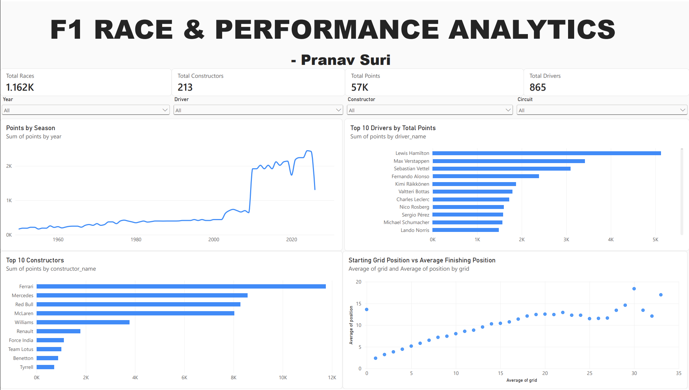

# F1 Race & Performance Analytics

An end-to-end Formula 1 analytics project built using **Python, SQL, SQLite, and Power BI** to analyze historical race results, driver performance, constructor performance, season trends, and starting-grid-to-finish performance.

---

## Dashboard Preview

*Note: The live Power BI report could not be publicly shared due to Power BI Free licensing limitations.*



The interactive Power BI dashboard provides an overview of Formula 1 race and performance data with filters for **year, driver, constructor, and circuit**.

---

## Project Overview

This project transforms raw Formula 1 datasets into a structured analytical dataset and uses SQL, Python, and Power BI to uncover performance trends across drivers, constructors, races, and circuits.

### Data Pipeline

```text
Raw F1 CSV Files
       |
       v
Python + Pandas
Data Cleaning & Transformation
       |
       v
Cleaned Analytical Dataset
       |
       +-------------------+
       |                   |
       v                   v
   SQLite + SQL        Python
   Analysis            Visualizations
       |                   |
       +---------+---------+
                 |
                 v
          Power BI Dashboard
```

---

## Dataset

The project works with historical Formula 1 data covering:

- Drivers
- Constructors
- Races
- Race Results
- Circuits

The final cleaned dataset contains **27,524 race-result records**.

---

## SQL Analysis

SQL was used to perform analytical queries including:

- Top 10 drivers by total points
- Top 10 constructors by total points
- Drivers with the most race wins
- Points by season
- Average finishing position
- Starting grid position vs average finishing position
- Most successful circuits
- Driver performance by season

The SQL analysis is stored in:

`sql/analysis_queries.sql`

---

## Python Analysis

Python and Pandas were used for:

- Dataset validation
- Data cleaning
- Missing-value handling
- Data type conversion
- Joining multiple F1 datasets
- Feature preparation
- Analytical processing
- Data visualization

The generated visualizations include:

- Top 10 Drivers by Total Points
- Top 10 Constructors by Total Points
- Points by Season
- Starting Grid Position vs Average Finishing Position

---

## Power BI Dashboard

The Power BI dashboard includes:

### KPIs

- Total Races
- Total Drivers
- Total Constructors
- Total Points

### Interactive Filters

- Year
- Driver
- Constructor
- Circuit

### Visualizations

- Points by Season
- Top 10 Drivers by Total Points
- Top 10 Constructors by Total Points
- Starting Grid Position vs Average Finishing Position

The dashboard was created using **Power BI Service**.

---

## Key Insights

The analysis highlights historical differences in:

- Driver championship performance
- Constructor performance
- Race-winning records
- Season-level scoring trends
- Starting-grid advantage
- Finishing performance
- Circuit-level performance

Historical total points should be interpreted in the context of changes to Formula 1's scoring systems across different eras.

---

## Project Structure

```text
F1-RACE-PERFORMANCE-ANALYTICS/
│
├── dashboard/
│   └── f1_dashboard.png
│
├── data/
│   ├── circuits.csv
│   ├── constructors.csv
│   ├── drivers.csv
│   ├── races.csv
│   └── results.csv
│
├── output/
│   ├── cleaned_f1_results.csv
│   ├── f1_analytics.db
│   ├── grid_vs_finish.png
│   ├── points_by_season.png
│   ├── top_10_constructors_points.png
│   └── top_10_drivers_points.png
│
├── python/
│   ├── create_database.py
│   ├── f1_analysis.py
│   ├── run_sql.py
│   ├── test_data.py
│   └── visualizations.py
│
├── sql/
│   └── analysis_queries.sql
│
├── README.md
└── .gitignore
```

---

## Tech Stack

| Technology | Purpose |
|---|---|
| Python | Data processing and analysis |
| Pandas | Data cleaning and transformation |
| Matplotlib | Data visualization |
| SQL | Analytical queries |
| SQLite | Local analytical database |
| Power BI | Interactive dashboard |
| Git & GitHub | Version control and project hosting |

---

## How to Run

### 1. Clone the repository

```bash
git clone https://github.com/pranavsuri05/f1-race-performance-analytics.git
cd f1-race-performance-analytics
```

### 2. Create a virtual environment

```bash
python3 -m venv venv
source venv/bin/activate
```

### 3. Install dependencies

```bash
pip install pandas matplotlib
```

### 4. Validate the datasets

```bash
python python/test_data.py
```

### 5. Run data cleaning and transformation

```bash
python python/f1_analysis.py
```

### 6. Create the SQLite database

```bash
python python/create_database.py
```

### 7. Run SQL analysis

```bash
python python/run_sql.py
```

### 8. Generate visualizations

```bash
python python/visualizations.py
```

---

## Author

**Pranav Suri**

B.Tech — Computer Science & Technology

[LinkedIn](https://www.linkedin.com/in/pranavsuri1/) • [GitHub](https://github.com/pranavsuri05)

---

**F1 Race & Performance Analytics**

*Turning historical Formula 1 data into actionable performance insights.*
